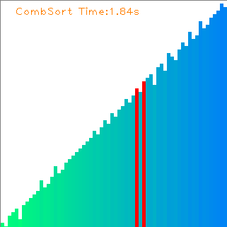
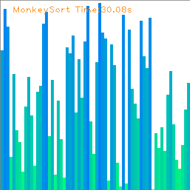

# Sorting Visualization

## Latest Update

- Add three more sort algorithms: `CombSort`, `RadixSort`,  `MonkeySort`
- Now you can record the whole sorting procedure to *avi videos.

## Introduction

This repository is a demo for visualizing 12 kinds of Sorting Algorithms. It aims to make Sort Algorithms easier to understand for programmers. Also, you can see the difference of Time Complexity between different sorting algorithms.

| Sorting Algorithm | AverageTime Complexity | Bad Time Complexity | Stability |
| ----------------- | ---------------------- | ------------------- | --------- |
| Bubble Sort       | O(N^2)                 | O(N^2)              | YES       |
| Insertion Sort    | O(N^2)                 | O(N^2)              | YES       |
| Shell Sort        | O(N^5/4)               | O(N^2)              | NO        |
| Selection Sort    | O(N^2)                 | O(n^2)              | NO        |
| Heap Sort         | O(NlogN)               | O(NlogN)            | NO        |
| Merge Sort        | O(NlogN)               | O(NlogN)            | YES       |
| Quick Sort        | O(NlogN)               | O(N^2)              | NO        |
| Bucket Sort       | O(N)                   | O(N)                | YES       |
| Cycle Sort        | O(N)                   | O(N^2)              | NO        |
| Comb Sort         | O(N^2)                 | O(N^2)              | NO        |
| Radix Sort        | O(N)                   | O(N)                | YES       |
| Monkey Sort       | O(N!)                  | O(N!)               | YES       |

## Dependencies

- python3.x
- cv2
- numpy

## Quick Start

0. Check all dependencies installed

     This command can help you install all the dependent packages

     `pip install -r requirements.txt`

1. Clone this repository

   `git clone git@github.com:ZQPei/Sort_Visualization.git`

2. Start

   `python main.py -l 512 -t BubbleSort`

   - `-l` `--length`: Array Length
   - `-t` `--sort-type`: Sorting Type. Default type is BubbleSort
     - BubbleSort
     - InsertionSort
     - ShellSort
     - SelectionSort
     - HeapSort
     - MergeSort
     - QuickSort
     - BucketSort
     - CycleSort
     - CombSort
     - RadixSort(LSD)
     - MonkeySort
   - `-i` `--interval`: Time Interval of next frame
   - `-r` `--repetition`: Array's Elements is Repeated or Not
   - `-n` `--no-record`: Don't record to *.avi video!

## Demos

|                            |                            |                         |
| -------------------------- | -------------------------- | ----------------------- |
|     |  |   |
|  |       |   |
|      |     |   |
|       |      |  |

### May you have fun!

