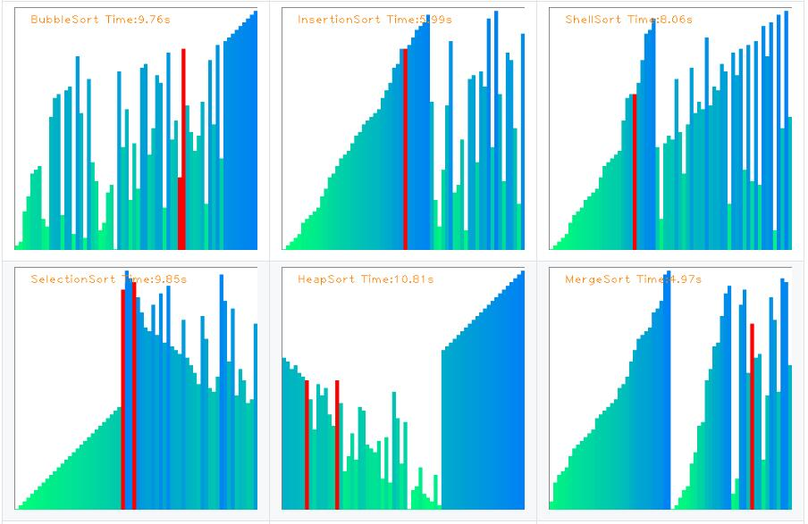
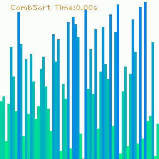

# Sorting Visualization and Audibilization

## Latest Update2 (05/04/2019)

- **Great News:** Now we can get the Voice of Sorting Algorithm simultaneously, and this is so funny that we should all have a try!!!

## Latest Update

- Add three more sorting algorithms: `CombSort`, `RadixSort`,  `MonkeySort`
- Now you can record the whole sorting procedure to *avi videos.
- Adding `-r` in command line can get you Re-sampled data.
- Adding `-s` in command line can get you Sparse data.

## Introduction

This repository is a demo of visualizing 12 types of Sorting Algorithms. It aims to make Sorting Algorithms easier for programmers to understand. Also, you can see the difference of Time Complexity between different sorting algorithms.

| Sorting Algorithm | AverageTime Complexity | Bad Time Complexity | Stability |
| ----------------- | ---------------------- | ------------------- | --------- |
| Bubble Sort       | O(N^2)                 | O(N^2)              | YES       |
| Insertion Sort    | O(N^2)                 | O(N^2)              | YES       |
| Shell Sort        | O(N^5/4)               | O(N^2)              | NO        |
| Selection Sort    | O(N^2)                 | O(n^2)              | NO        |
| Heap Sort         | O(NlogN)               | O(NlogN)            | NO        |
| Merge Sort        | O(NlogN)               | O(NlogN)            | YES       |
| Quick Sort        | O(NlogN)               | O(N^2)              | NO        |
| Bucket Sort       | O(N)                   | O(N)                | YES       |
| Cycle Sort        | O(N)                   | O(N^2)              | NO        |
| Comb Sort         | O(N^2)                 | O(N^2)              | NO        |
| Radix Sort        | O(N)                   | O(N)                | YES       |
| Monkey Sort       | O(N!)                  | O(N!)               | YES       |

## Demos

|                            |                            |                         |
| -------------------------- | -------------------------- | ----------------------- |
|     |  |   |
|  |       |   |
|      |     |   |
|       |      |  |

## Dependencies

- python3.x
- cv2
- numpy
- pygame

## Quick Start

0. Check all dependencies installed

      This command can help you install all the dependent packages

      `pip install -r requirements.txt`

1. Clone this repository

   `git clone git@github.com:ZQPei/Sort_Visualization.git`

2. Start

   `python main.py -l 512 -t BubbleSort`

   - `-l` `--length`: Array Length
   - `-t` `--sort-type`: Sorting Type. Default type is BubbleSort
     - BubbleSort
     - InsertionSort
     - ShellSort
     - SelectionSort
     - HeapSort
     - MergeSort
     - QuickSort
     - BucketSort
     - CycleSort
     - CombSort
     - RadixSort(LSD)
     - MonkeySort
   - `-i` `--interval`: Time Interval of next frame
   - `-r` `--resample`: Get Resampled Array
   - `-s` `--sparse`: Sparse Array
   - `-n` `--no-record`: Don't record to *.avi video!
   - `--silent`: No voice output
   - `--sound-interval`: Time of sound

### May you have fun!

