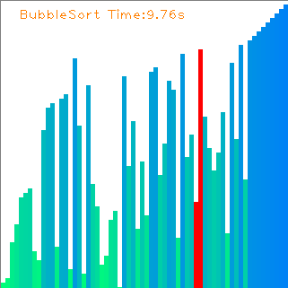
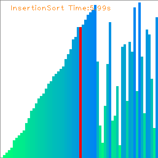
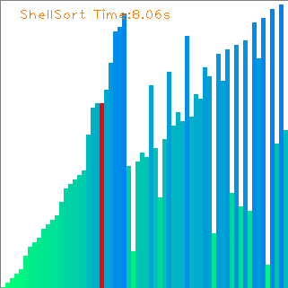
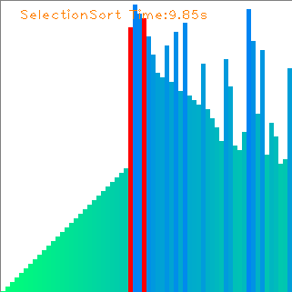
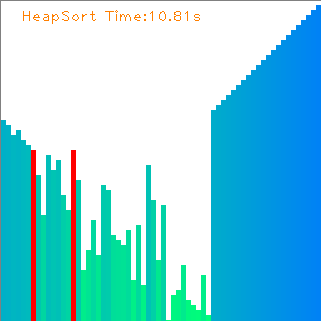
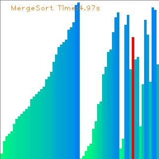
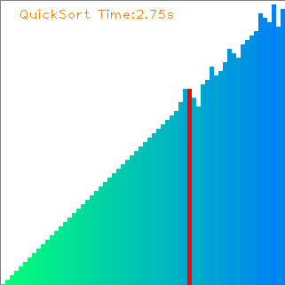
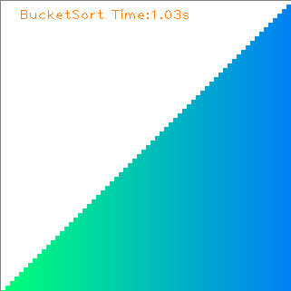

# Sorting Visualization

## Introduction

This repository is a demo for visualizing Nine kinds of Sorting Algorithms. It aims to make Sort Algorithms easier to understand for programmers. Also, you can see the difference of Time Complexity between different sorting algorithms.

| Sorting Algorithm | Time Complexity |
| ----------------- | --------------- |
| Bubble Sort       | O(N^2)          |
| Insertion Sort    | O(N^2)          |
| Shell Sort        | O(NlogN)        |
| Selection Sort    | O(N^2)          |
| Heap Sort         | O(NlogN)        |
| Merge Sort        | O(NlogN)        |
| Quick Sort        | O(NlogN)        |
| Bucket Sort       | O(N)            |
| Cycle Sort        | O(N^2)          |

|                            |                            |                        |
| -------------------------- | -------------------------- | ---------------------- |
|     |  |  |
|  |       |  |
|      |     |  |

## Dependencies

- python3.x
- cv2
- numpy

## Quick Start

0. Check all dependencies installed

1. Clone this repository

   `git clone git@github.com:ZQPei/Sort_Visualization.git`

2. Start

   `python main.py -l 512 -t BubbleSort`

   - `-l` `--length`: Array Length
   - `-t` `--sort-type`: Sorting Type. Default type is BubbleSort
     - BubbleSort
     - InsertionSort
     - ShellSort
     - SelectionSort
     - HeapSort
     - MergeSort
     - QuickSort
     - BucketSort
     - CycleSort
   - `-i` `--interval`: Time Interval of next frame
   - `-r` `--repetition`: Array's Elements is Repeated or Not

### May you have fun!

